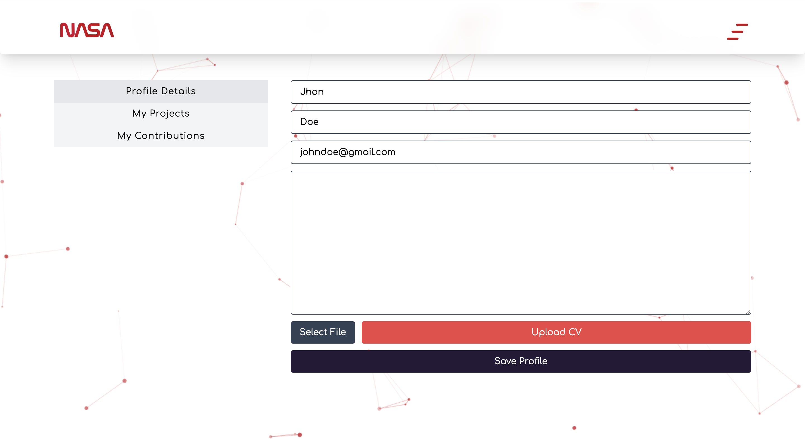
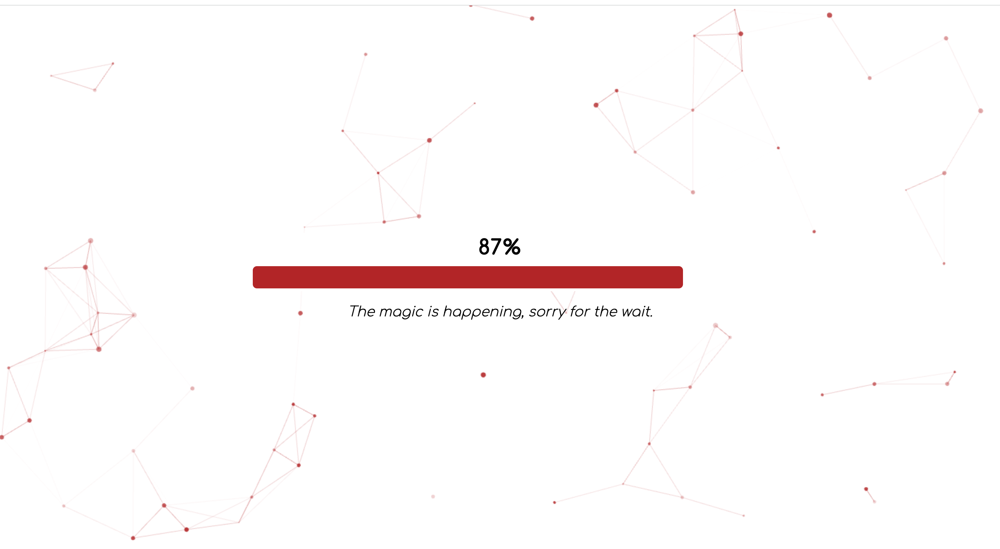

# Space Apps 2023 - A Marketplace for Open Science Projects

## HIGH-LEVEL SUMMARY

We have developed a groundbreaking platform named "418 Teapot," which serves as a marketplace for open science projects. The core challenge we aimed to address is the efficient matchmaking between individuals eager to contribute to open-source scientific endeavors and the relevant projects that need their expertise. Our solution leverages the power of Artificial Intelligence (AI), specifically Natural Language Processing (NLP) and machine learning techniques, to tackle this challenge. The importance of our project lies in bridging the gap between open-source science projects and potential contributors. By streamlining the project-user matchmaking process, we empower scientists, researchers, and enthusiasts to find and engage with projects aligned with their expertise and interests. This fosters collaboration, accelerates scientific progress, and ultimately contributes to the growth of open science initiatives. Our innovative approach not only benefits individual users but also advances the entire field of open science by ensuring that the right talent finds the right projects, resulting in more impactful contributions and discoveries.

## PROJECT DETAILS

Our team has developed a marketplace platform for open-source science projects. This platform aims to connect contributors interested in open-source science projects with these projects.

In today's landscape, many platforms use tagging methods to match users with open-source projects. However, this approach has some drawbacks. Manual tagging can lead to outdated and unused tags over time. Additionally, as projects evolve, the tagging system may become inefficient.

Our solution, on the other hand, doesn't completely disregard the past; it incorporates data extraction from past experiences using a Natural Language Processing (NLP) model. This involves a visual representation of approximately 15,000 project data points, which we've reduced to a two-dimensional format using Principal Component Analysis (PCA). Our aim is to enhance the matching of users with projects by utilizing this data.

User profiles are created by uploading CVs, which are used to generate summaries. These profiles are then utilized to identify suitable projects based on a user's skills and interests.

This project offers a novel approach to effectively match individuals interested in contributing to science projects with those projects. By overcoming the challenges faced by tagging systems using natural language processing and machine learning techniques, it facilitates better matchmaking between projects and potential contributors.

Opportunities exist to enhance project owner's ability to find suitable users. Additionally, improving data collection and analysis processes can make the platform even more effective.

Our platform offers a seamless process for project submission and collaboration. Project owners can easily submit their projects through our user-friendly interface. Once a project is listed, other users can express their interest and support by submitting requests to join the project team. This feature fosters a collaborative and dynamic ecosystem where projects receive the support and expertise they need, and users can actively engage with initiatives that align with their skills and interests. Our platform serves as a hub for the exchange of knowledge, skills, and ideas, driving open science projects forward and promoting collaboration within the scientific community.

## USE OF ARTIFICIAL INTELLIGENCE

<strong>Natural Language Processing (NLP):</strong> We utilized NLP techniques to analyze and extract valuable insights from text data, including project descriptions, user profiles, and CVs. This allowed us to understand and categorize the skills, interests, and project details more effectively.

<strong>Machine Learning Algorithms:</strong> Our project involved the use of machine learning algorithms, such as the KMeans clustering algorithm and Principal Component Analysis (PCA). These algorithms helped us cluster and reduce the dimensionality of project data, ultimately enhancing the project-user matching process.

<strong>Continuous Learning Model:</strong> To ensure the long-term relevance of our platform, we implemented a continuous learning model. This AI model continuously learns from new data and user interactions, refining its recommendations over time to better match users with open-source science projects. By incorporating these AI techniques, we were able to create a dynamic and efficient platform that optimizes the user experience and fosters meaningful connections between project contributors and open science initiatives.

## SPACE AGENCY DATA

[Open Source Science Initiative](https://science.nasa.gov/researchers/open-science/).
[Citizen Science](https://science.nasa.gov/citizen-science/).

## REFERENCES

[Topic Modeling for Research Articles](https://www.kaggle.com/datasets/blessondensil294/topic-modeling-for-research-articles?select=train.csv).
[Doc2Vec Model](https://radimrehurek.com/gensim/auto_examples/tutorials/run_doc2vec_lee.html#sphx-glr-auto-examples-tutorials-run-doc2vec-lee-py).

 

## PROJECT PRESENTATION

[A Marketplace for Open Science Projects](https://docs.google.com/presentation/d/1YHf-KX24UWrnEGlsdAfaMpGfR6BBbG80/edit?usp=sharing&ouid=113200277405704067523&rtpof=true&sd=true)

 

 

 

 

 

 

 

 

 

 

 

 

 
